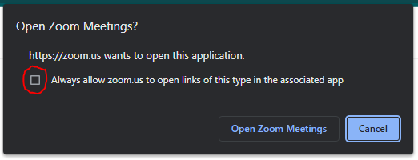

# AutoJoinZoom

## Description

Hello! I created this mainly to automatically join my own zoom classes. The code is mainly
personalized for my own convenience but just in case if you wanna know how to get it to work
I'll be providing the details down below.

## Details

- To be able to join a zoom meeting, you first have to go to `config/settings.json` and inside
  the `"meetings"` property array, you have to set your zoom meetings there with its details such
  as the `"days"` of when the day of the week it occurs and `"hour"` of the hour it starts.

```json
[
  {
    "chrome_profile": "",
    "meetings": [
      {
        "name": "name",
        "link": "",
        "days": ["monday", "wednesday"],
        "hour": { "start": "12:00", "end": "12:40" }
      },
      {
        "name": "name",
        "link": "",
        "days": ["tuesday", "thursday"],
        "hour": { "start": "13:55", "end": "14:35" }
      }
    ]
  }
]
```

- In the `"link"` you have to provide the zoom link that directly leads to the meeting. Once
  that time comes of when the zoom meeting starts. Your web browser is going to open that link
  you stored in the `"link"` property.
- As an extra convenience tip, make sure to check the checkbox circled with red in the image
  so you don't have to go through that confirmation tab over and over again whenever my code
  starts joining you.



- There's also an SQLite database in the `sql` directory that just stores the meetings you join,
  of when you join them, and when you open the program.
- One last note, is that I mainly use this by compiling my program to an `.exe` file with pyinstaller
  then just changing the values in `config/settings.json` to my meetings. And of course, I hid them
  for privacy reasons.

## Contact

If you have any questions you can contact me via discord. My discord tag is **DragonWF#9321**.
